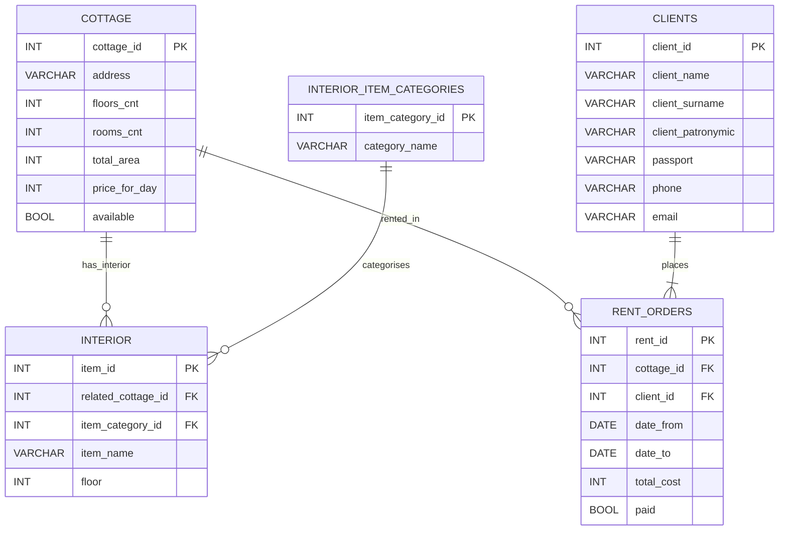

# ER‑диаграмма и описание схемы базы данных `cottage_rentals_database`

## Описание сущностей

### `cottage`
* **Назначение:** сведения о коттеджах, доступных для аренды.  
* **Поля:** `cottage_id` (PK), `address`, `floors_cnt`, `rooms_cnt`, `total_area`, `price_for_day`, `available`.  
* **Связи:**  
  * 0..N `interior` — коттедж содержит множество предметов интерьера.  
  * 0..N `rent_orders` — коттедж упоминается в заказах.

### `interior_item_categories`
* **Назначение:** справочник категорий предметов интерьера.  
* **Поля:** `item_category_id` (PK), `category_name`.  
* **Связь:** 1 → N `interior`.

### `interior`
* **Назначение:** отдельные предметы внутри коттеджей.  
* **Поля:** `item_id` (PK), `related_cottage_id` (FK), `item_category_id` (FK), `item_name`, `floor`.  
* **Связи:** принадлежит одному коттеджу и одной категории.

### `clients`
* **Назначение:** персональные и контактные данные клиентов.  
* **Поля:** `client_id` (PK), `client_name`, `client_surname`, `client_patronymic`, `passport` (UQ), `phone` (UQ), `email` (UQ).  
* **Связь:** 1 → N `rent_orders`.

### `rent_orders`
* **Назначение:** факты бронирования коттеджей.  
* **Поля:** `rent_id` (PK), `cottage_id` (FK, nullable), `client_id` (FK), `date_from`, `date_to`, `total_cost`, `paid`.  
  Уникальные пары (`cottage_id`, `date_from`) и (`cottage_id`, `date_to`) не дают пересекаться броням.  
* **Связи:** ссылка на коттедж и обязательная ссылка на клиента (`CASCADE`).

## Таблица связей

| От | К | Кратность | Семантика |
|---|---|---|---|
| `cottage` | `interior` | 0..N | Коттедж содержит предметы |
| `interior_item_categories` | `interior` | 1 — N | Категория группирует предметы |
| `cottage` | `rent_orders` | 0..N | Коттедж фигурирует в заказах |
| `clients` | `rent_orders` | 1 — N | Клиент оформляет заказы |
